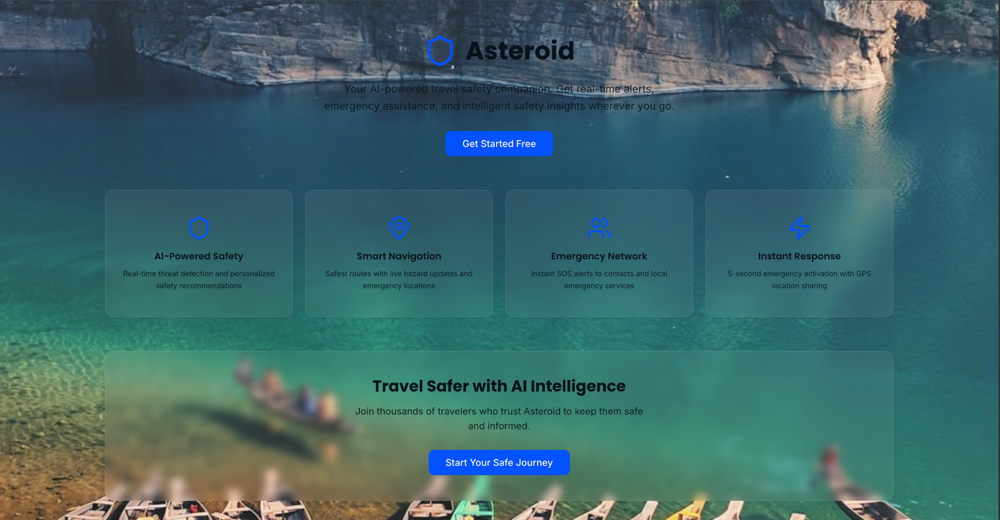
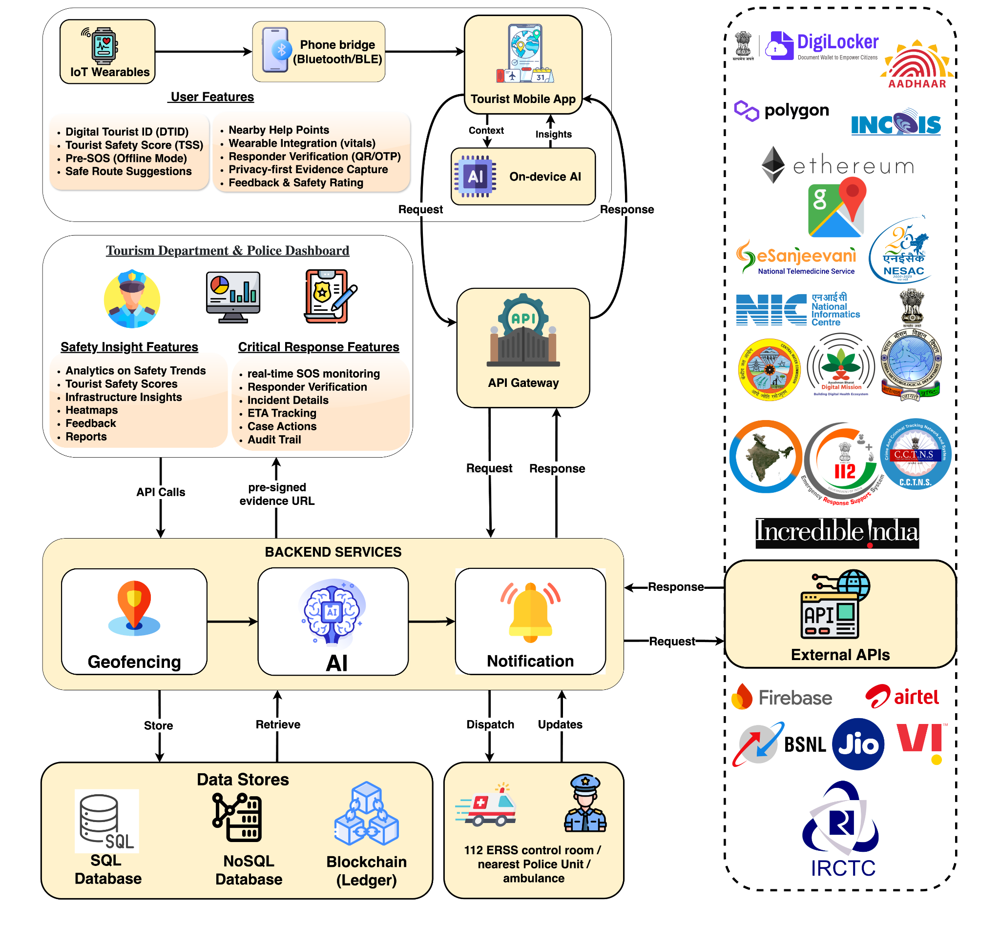
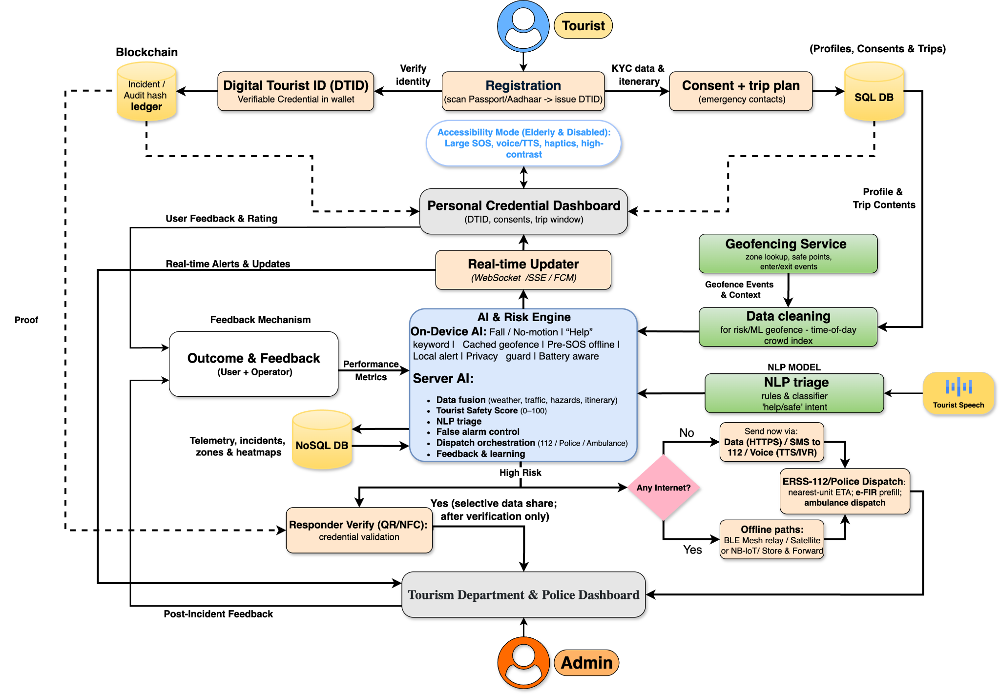

# 🌍 Asteroid

> AI-Powered Tourist Safety Companion Platform  
> Built for **Smart India Hackathon 2025**

<p align="center">
  
  
  
  
  
</p>

---

# ✨ About Asteroid

**Asteroid** is an AI-powered tourist safety ecosystem designed to improve traveler safety using:

- 🧠 AI-powered risk analysis
- 🚨 Smart SOS emergency system
- 🗺️ Safe route navigation
- 📍 Geofencing & hazard detection
- ❤️ IoT wearable monitoring
- 🪪 Digital Tourist ID (DTID)
- 📡 Offline emergency support
- 👮 Tourism & Police dashboard integration

The platform aims to create a safer and smarter travel experience by integrating AI, emergency systems, blockchain identity, geofencing, and real-time safety analytics.

---

# 📸 Screenshots

## 🏠 Landing Page

<p align="center">
  
</p>

---

# 🧠 System Architecture

## 🔷 High-Level Architecture

<p align="center">
  
</p>

---

## 🔷 AI & Emergency Workflow

<p align="center">
  
</p>

---

# 🎥 Demo Video

👉 https://youtu.be/uvp0D-OxJrM

---

# 🚀 Core Features

| Feature | Description |
|----------|-------------|
| 🛡️ AI Safety Monitoring | Real-time tourist safety analysis |
| 🚨 Emergency SOS | Instant emergency alert system |
| 🗺️ Smart Navigation | Safe route recommendations |
| 📍 Geofencing | Risk zone monitoring |
| ❤️ IoT Integration | Wearable health monitoring |
| 🪪 Digital Tourist ID | Secure traveler identity |
| 📶 Offline Support | Emergency features without internet |
| 🤖 AI Assistant | Personalized safety guidance |
| 📊 Admin Dashboard | Tourism & police monitoring system |
| 🔐 Blockchain Support | Tamper-proof incident audit system |

---

# 🧠 AI Capabilities

Asteroid uses AI for:

- Tourist risk prediction
- Hazard analysis
- NLP-based emergency detection
- Smart alert generation
- Tourist safety scoring
- False alarm reduction
- Emergency dispatch orchestration
- Safety recommendations

---

# 🏗️ System Modules

## 👤 Tourist Application

- Tourist dashboard
- Safety score
- AI travel assistant
- Emergency SOS
- Nearby safe points
- Smart navigation
- Offline emergency mode
- Wearable device pairing

---

## 👮 Admin Dashboard

- Safety heatmaps
- Incident monitoring
- Tourist analytics
- Emergency coordination
- Feedback & reports
- Real-time alert tracking

---

## ⚙️ Backend Services

- AI Engine
- Notification Service
- Geofencing Service
- Risk Assessment
- Emergency Dispatch System
- Blockchain Audit Logs

---

# 🛠️ Tech Stack

| Category | Technologies |
|----------|--------------|
| Frontend | Next.js 14, React, TypeScript |
| Styling | Tailwind CSS, shadcn/ui |
| State Management | Zustand |
| Backend | Node.js |
| AI | AI Risk Engine, NLP |
| Database | SQL + NoSQL |
| Mapping | Google Maps APIs |
| Blockchain | Polygon / Ethereum |
| Deployment | Vercel |

---

# 📂 Project Structure

```bash
├── app/
├── components/
├── hooks/
├── lib/
├── public/
├── styles/
├── store/
└── utils/
```

---

# ⚡ Getting Started

## 1️⃣ Clone Repository

```bash
git clone https://github.com/your-username/asteroid.git
cd asteroid
```

---

## 2️⃣ Install Dependencies

```bash
pnpm install
```

or

```bash
npm install
```

---

## 3️⃣ Run Development Server

```bash
pnpm dev
```

Open:

```bash
http://localhost:3000
```

---

# 📦 Available Scripts

| Command | Description |
|----------|-------------|
| `pnpm dev` | Start development server |
| `pnpm build` | Production build |
| `pnpm start` | Start production server |
| `pnpm lint` | Run ESLint |

---

# 🔐 Future Enhancements

- 🌐 Multi-language support
- 📡 Satellite emergency mode
- 🛰️ Real-time GPS tracking
- 🤖 Advanced predictive AI
- 📶 Mesh communication
- 🧬 Smart wearable integration
- 🚑 Government emergency integration

---

# 👨‍💻 Team Members

- Mr. Tiuvrat Khumukcham
- Mr. Mayangmayum Arkib
- Mr. Thoithoi Chirom
- Mr. Malemnganba Achom
- Ms. Chiveinai Christina
- Ms. Siiveinai Sweety Reo

---

# 🏆 Hackathon

### Smart India Hackathon 2025

Asteroid was developed as an innovative solution for improving tourist safety using AI, IoT, geofencing, emergency systems, and intelligent risk monitoring.

---

# 📜 License

This project is currently for educational and hackathon purposes.

---

# ❤️ Acknowledgements

Special thanks to:

- Smart India Hackathon 2025
- Open-source community
- Tourism & safety innovation initiatives

---

# 🌟 Support

If you like this project:

⭐ Star this repository  
🍴 Fork the project  
📢 Share with others

---

<p align="center">
  Built with ❤️ using AI, Next.js & Modern Web Technologies
</p>